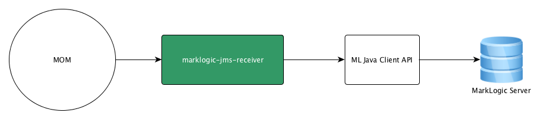

# Overview
marklogic-jms-receiver is standalone java application to receive the message(s) from a Java Messaging Service (JMS) based Message Oriented Middleware (MOM) and to push those messages into MarkLogic as JSON, XML or Text documents.

# High-Level Architecture Diagram

# Configuration
Please refer to configuration file [here.]https://github.com/sanjuthomas/marklogic-jms-receiver/blob/master/config/connection.properties)
The receiver is tested against Apache Active MQ. If you are using a different MOM, please change the initial_context_factory property.
